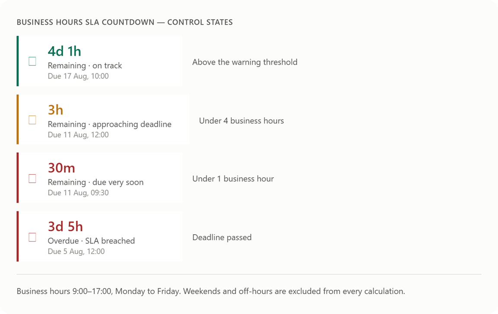

# ⏱️ Business Hours SLA Countdown — PCF Control

A **Power Apps Component Framework (PCF)** control that displays a **live countdown to an SLA deadline** — counting **only business hours**, not calendar time. It re-renders automatically and changes color as the deadline approaches or is breached.

Built as a **virtual control** with **React + Fluent UI 9** for native integration in **Model-Driven Apps** (Customer Service, Field Service, and any SLA-driven scenario).



---

## ✨ Why this control

Standard Dynamics 365 SLA timers show calendar time. But a case due "in 18 hours" at 4 PM on a Friday is actually due **Tuesday morning** if your team works 9–5, Monday–Friday. This control does that math **client-side, live**, so agents see the real, honest time they have left.

| Feature | Description |
|---|---|
| **Business-hours math** | Counts only configured working hours on configured working days |
| **Live countdown** | Auto-refreshes every 30 seconds — no page reload needed |
| **Color-coded status** | 🟢 On track → 🟠 Approaching → 🔴 Due very soon / breached |
| **Overdue handling** | Shows how long past the deadline, in business hours |
| **Fully configurable** | Working hours, working days, and both thresholds are properties |
| **Zero external services** | All computation is client-side; no API calls |

---

## 🎯 Use Cases

- **Customer Service** — Case resolution / first-response SLA countdowns
- **Field Service** — Work order response deadlines
- **Sales** — Follow-up commitments with time-bound promises
- **Any entity** with a Date/Time deadline field

---

## ⚙️ Configuration

Add the control to a **Date and Time** field on your form, then set:

| Property | Required | Default | Description |
|---|---|---|---|
| **SLA Deadline** | ✅ (bound) | — | The Date/Time field holding the deadline (e.g. Case *Resolve By*) |
| **Business Hour Start** | ❌ | `9` | Hour the business day starts (0–23) |
| **Business Hour End** | ❌ | `17` | Hour the business day ends (0–23) |
| **Working Days** | ❌ | `1,2,3,4,5` | Comma-separated day numbers, `0`=Sunday … `6`=Saturday |
| **Warning Threshold (business hours)** | ❌ | `4` | Below this many remaining business hours → orange |
| **Danger Threshold (business hours)** | ❌ | `1` | Below this many remaining business hours → red |

---

## 📦 Installation

### Build from Source

```bash
# Prerequisites: Node.js 18+, npm, .NET SDK, PAC CLI

git clone https://github.com/HakimMouchquelita/business-hours-sla-countdown.git
cd business-hours-sla-countdown

npm install
npm run build

# Test locally
npm start

# Deploy to a Dataverse environment
pac auth create --environment https://yourorg.crm.dynamics.com
pac pcf push --publisher-prefix hmq
```

### Or package as a solution

```bash
mkdir Solutions && cd Solutions
pac solution init --publisher-name HMQ --publisher-prefix hmq
pac solution add-reference --path ..
dotnet build
```

The managed/unmanaged `.zip` is produced under `Solutions/bin/Debug/`.

---

## 🏗️ Architecture

```
BusinessHoursSLACountdown/
├── ControlManifest.Input.xml   # Manifest (bound deadline + config properties)
├── index.ts                    # PCF lifecycle (reads field + config, builds props)
├── businessHours.ts            # Pure calculation logic (business-hours math)
├── SLACountdown.tsx            # React component (live tick, color states)
└── generated/
    └── ManifestTypes.d.ts      # Auto-generated typings
```

The business-hours math lives in `businessHours.ts` as **pure, testable functions** — the calculation is decoupled from the UI, which makes it easy to reason about and extend (e.g. holiday calendars).

---

## 🔧 Development

```bash
npm start          # test harness
npm run start:watch # hot reload
npm run build      # production build
npm run lint       # lint
```

---

## 🤝 Contributing

Issues and pull requests welcome. Ideas for roadmap: holiday-calendar support, Dataverse Calendar entity integration, and per-record business-hours lookup.

---

## 📄 License

[MIT](./LICENSE) — © 2026 [Hakim Mouchquelita](https://www.linkedin.com/in/hakimmouchquelita/)

---

## 🔗 Links

- **Author**: [Hakim Mouchquelita](https://www.linkedin.com/in/hakimmouchquelita/) — Microsoft MVP, Business Applications · Solution Architect Power Platform & AI
- **GitHub**: [HakimMouchquelita](https://github.com/HakimMouchquelita)
